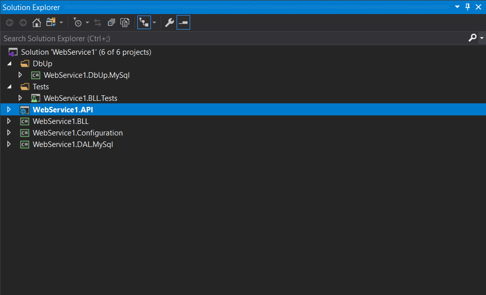

 ###  WebAPI template with JWT token auth, DB connection, Health checks and HTTP client proxy examples.

Projects template description
----

 - WebService.API project - web api with system configurations (auth, logging, api docs)
 - WebService.Configuration project - configuration for logic services and repositories
 - WebService.BLL project - logic services
 - WebService.DAL.MySql project - repositories
 - WebService.BLL.Tests project - unit test for BLL logic
 - WebService.DbUp.MySql project - MySql database migrations

Usings
----
 - .NET Core 3.0 
 - Serilog for logging and exception handling
 - AutoMapper for models mappings
 - API versioning
 - Swagger for API documentation 
 - Micro-ORM Dapper with MySql repository  
 - DbUp for database migrations
 - .Net Core health checks
 - .NET Core builtin HttpClientFactory with Polly (https://jsonplaceholder.typicode.com/ as fake mock api)
 - XUnit with Moq and AutoFixture for unit test   

Preview
----

How to use
----
- Install project template in Visual Studio 2019. Extensions -> Manage Extensions -> Online -> Visual Studio Marketplace -> Search: Web API Template (.NET Core 3.0)

- Manualy download and install VSIX Package for Visual Studio 2019 from Visual Studio marketplace. https://marketplace.visualstudio.com/items?itemName=ddiyteam.WebApiTemplateNetCore3

- Clone repository and open solution from WebApiTemplate folder in Visual Studio 2019 or Visual Studio Code directly.

License
----

MIT

